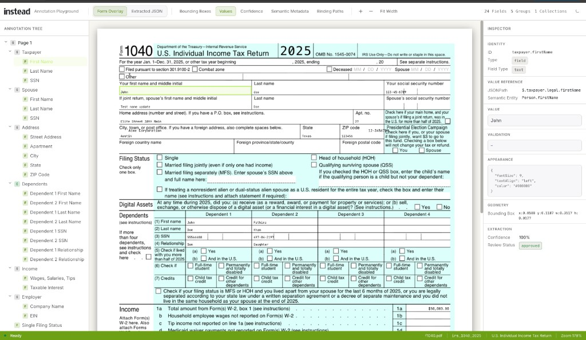
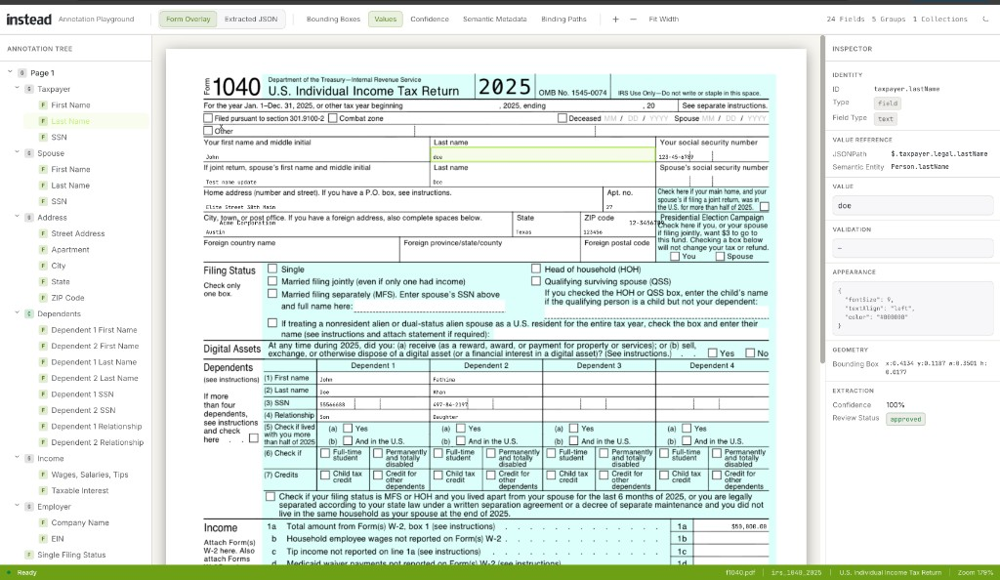
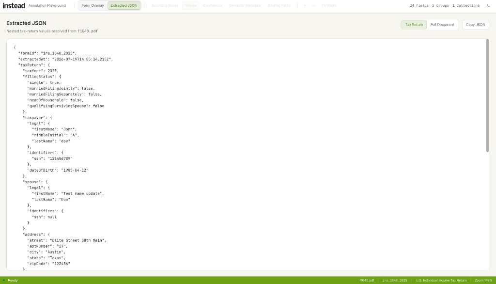
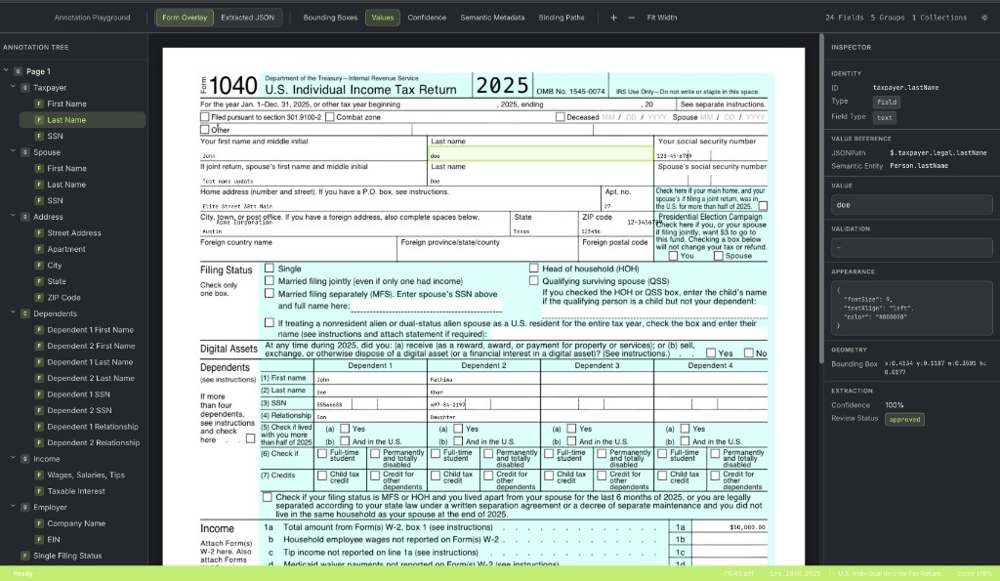

# Instead Engineer Assessment — Tax Form Annotation Spec

A portable data structure for annotating fields/boxes on U.S. tax forms, with a reference Angular playground that prints nested tax-return values into each box.

**Assessment focus:** positioning · formatting · deep value references

---

## Deliverables

| Artifact | Location |
|----------|----------|
| **Written specification** | [`docs/SPECIFICATION.md`](docs/SPECIFICATION.md) |
| **JSON Schema** | [`docs/schema/annotation-template.schema.json`](docs/schema/annotation-template.schema.json) |
| **TypeScript model** | [`src/app/models/annotation.model.ts`](src/app/models/annotation.model.ts) |
| **Path resolver** (nested JSONPath) | [`src/app/utils/path-resolver.ts`](src/app/utils/path-resolver.ts) |
| **Example Form 1040 template** | [`src/assets/templates/irs_1040_2025.json`](src/assets/templates/irs_1040_2025.json) |
| **Nested sample tax data** | [`src/assets/values/irs_1040_2025.sample.json`](src/assets/values/irs_1040_2025.sample.json) |
| **Sample Form 1040 PDF** | [`samples/f1040.pdf`](samples/f1040.pdf) |
| **Demo screenshots** | [`docs/demo/`](docs/demo/) |
| **Reference overlay app** | Angular playground (this repo) |

---

## Demo screenshots

Form overlay with values printed into each annotated box, plus the inspector for a selected field:



Annotation tree, PDF overlays, and inspector showing JSONPath / geometry / confidence:



Extracted nested tax-return JSON resolved from the uploaded PDF:



Bounding boxes and printed values across taxpayer, address, dependents, and income:



---

## Spec in 30 seconds

```json
{
  "id": "income.wages",
  "type": "field",
  "fieldType": "currency",
  "valueRef": { "path": "$.income.w2Forms[0].wages" },
  "appearance": { "fontSize": 10, "textAlign": "right", "color": "#000000" },
  "boundingBox": { "x": 0.72, "y": 0.358, "width": 0.20, "height": 0.018 }
}
```

1. **Positioning** — `boundingBox` uses normalized `0–1` coordinates (origin top-left).  
2. **Formatting** — `fieldType` + `appearance` (+ optional `format`) control how values print.  
3. **Deep references** — `valueRef.path` is a JSONPath subset into nested `taxReturn` data.

A print engine loads the form PDF, the template, and proprietary nested data, then for each field: resolve path → format → draw inside the box.

See also in [`docs/SPECIFICATION.md`](docs/SPECIFICATION.md):

- **§2.1 Key decisions** — why normalized coords, JSONPath, and a two-document model  
- **§14 Future enhancements** — conditional visibility, multi-entity packs, visual authoring, and more  

---

## Quick start (demo)

```bash
npm install
npm start
```

Open [http://localhost:4200](http://localhost:4200), upload an **IRS Form 1040 (2025)** PDF, and explore overlays, the annotation tree, and the inspector.

### Sample form (if you don’t have one)

Use the included blank IRS Form 1040 (2025) for testing:

[`samples/f1040.pdf`](samples/f1040.pdf)

Download that file, drag it onto the upload screen, and the playground will detect the form and render annotations.

### Demo controls

- Toggle bounding boxes, printed values, confidence, semantic metadata, binding paths
- Click a box → inspect JSONPath, geometry, validation, appearance
- Edit a value → overlay updates in memory

---

## How nested value references work

Sample data (abbreviated):

```json
{
  "taxReturn": {
    "taxpayer": { "legal": { "firstName": "Jane" }, "identifiers": { "ssn": "123456789" } },
    "dependents": [{ "identifiers": { "ssn": "987654321" }, "relationship": "Son" }],
    "income": { "w2Forms": [{ "wages": 78500 }] }
  }
}
```

| Annotation | `valueRef.path` |
|------------|-----------------|
| First name | `$.taxpayer.legal.firstName` |
| Dependent SSN | `$.dependents[0].identifiers.ssn` |
| Wages (line 1a) | `$.income.w2Forms[0].wages` |

Resolver implementation: `src/app/utils/path-resolver.ts`.

---

## Project structure

```
docs/
  SPECIFICATION.md          # Full written spec (primary assessment doc)
  schema/                   # JSON Schema
  demo/                     # Playground screenshots
samples/
  f1040.pdf                 # Sample IRS Form 1040 (2025) for testing
src/app/
  models/                   # TypeScript interfaces
  utils/path-resolver.ts    # Nested path resolution
  services/                 # PDF, template, values, renderer
  components/ + pages/      # Playground UI
src/assets/
  templates/                # Annotation JSON
  values/                   # Nested tax-return samples
```

---

## Extending to another form

1. Add `src/assets/templates/{formId}.json`
2. Add sample nested data under `src/assets/values/`
3. Register in `TemplateRegistryService`
4. Add detection rules in `FormDetectionService`

---

## Tech stack

Angular 20 · TypeScript · PDF.js · Tailwind CSS v4

No backend — everything runs in the browser.
